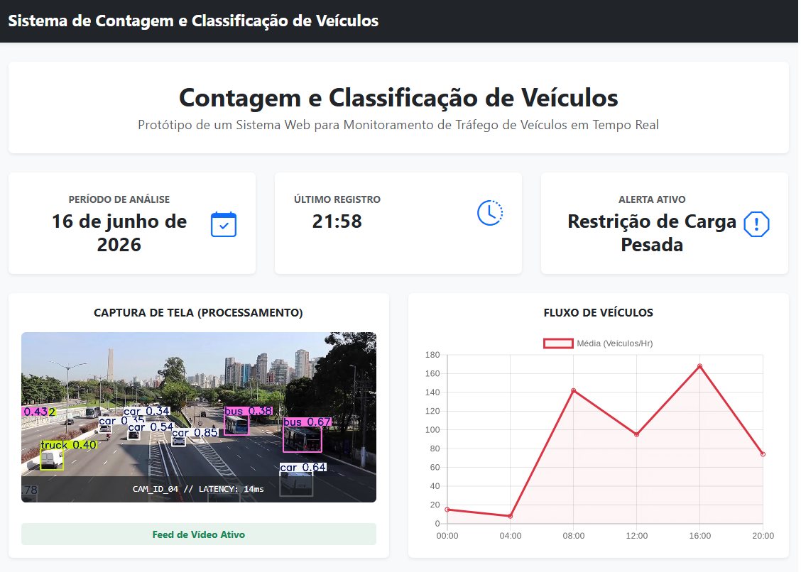
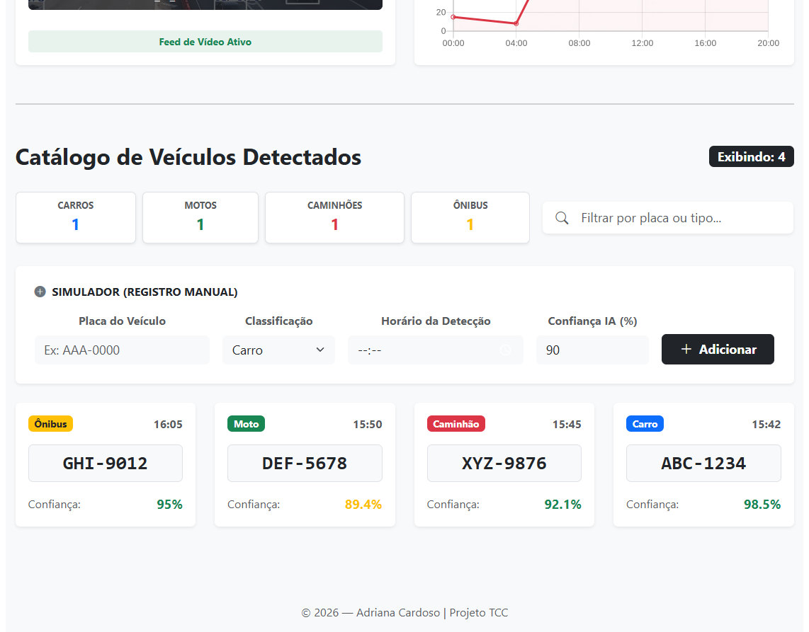

# Atividade: Catálogo Dinâmico com Busca e Gerenciamento de Estado

## 📸 Captura de tela

<table align="center">
  <tr>
    <td></td>
    <td></td>
  </tr>
</table>

---

Este projeto foi desenvolvido por Adriana Cardoso para fins acadêmicos.
